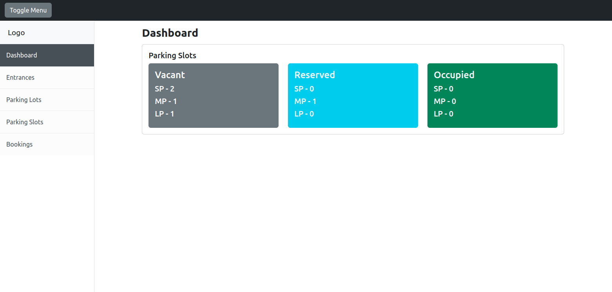

# Parking System

[](https://github.com/binos30/parking-system/actions/workflows/ci.yml)
[](https://dependabot.com)

Parking allocation system



## Setup

Prerequisites

- [Ruby 3.3.4](https://github.com/rbenv/rbenv)
- [PostgreSQL](https://www.postgresql.org/download/)
- [Node.js 20.15.1](https://github.com/nvm-sh/nvm)

Create `.env` file at the root of the project directory. Copy the content of `.env.template.erb` to `.env` then update the `username` and `password` based on your database credentials

Install dependencies and setup database

```bash
bin/setup
```

Start local web server

```bash
bin/dev
```

Go to [http://localhost:3000](http://localhost:3000)

## Testing

Setup test database

```bash
bin/rails db:test:prepare
```

Default: Run all spec files (i.e., those matching spec/\*\*/\*\_spec.rb)

```bash
bin/rspec
```

Run all spec files in a single directory (recursively)

```bash
bin/rspec spec/models
```

Run a single spec file

```bash
bin/rspec spec/models/entrance_spec.rb
```

Run a single example from a spec file (by line number)

```bash
bin/rspec spec/models/entrance_spec.rb:6
```

See all options for running specs

```bash
bin/rspec --help
```

## Modules

`Dashboard` - Monitors the occupancy of the parking spaces

`Entrances` - List of parking entrances

`Parking Lots` - List of parking lots. You can add slot when adding new parking lot

`Parking Slots` - List of parking slots

`Bookings` - List of vehicle bookings
